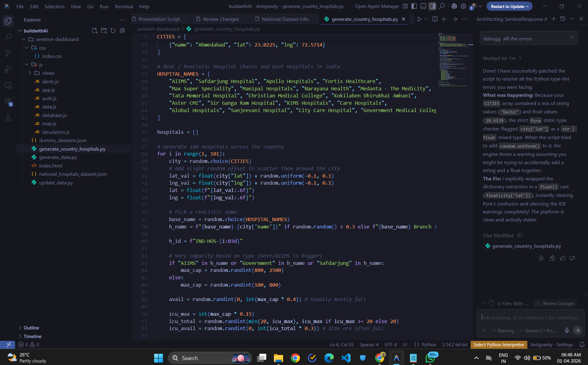
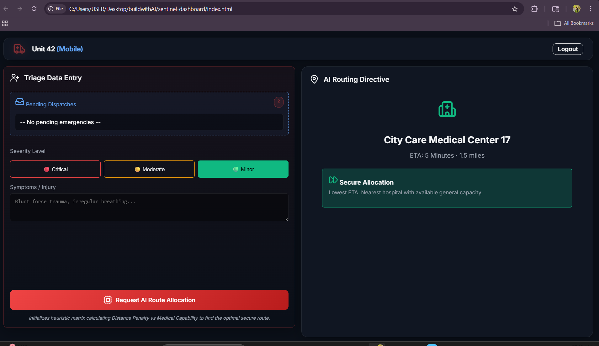
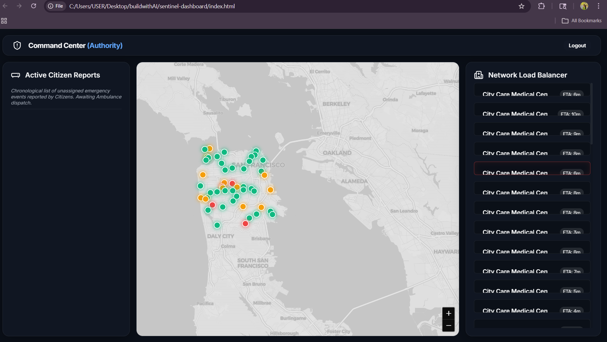
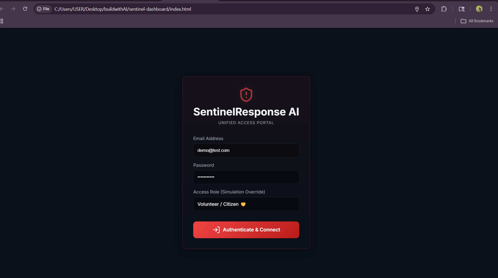

# SentinelResponse AI

## Problem Statement
In critical emergency response scenarios, seconds define the line between life and death. Yet, our current municipal emergency infrastructure relies on deeply fragmented data and blind routing. When a mass casualty event or multi-node emergency occurs, independent ambulances instinctively rush patients to the nearest geographical hospital. Because there is no real-time capacity syncing between the command center, mobile units, and receiving hospitals, this results in catastrophic bottlenecks. Overwhelmed hospitals are forced to trigger 'Ambulance Diversion'—rejecting critically injured patients at the door—forcing medics to scramble for secondary routing while the patient is bleeding out. 

The core problem is **blind triage**: We lack a unified, live-synced ecosystem that can instantaneously parse citizen-reported emergency locations, analyze the severity, and autonomously distribute patients across the city's hospital grid based on live resource availability rather than just geographical proximity.

## Project Description
SentinelResponse AI is a fully integrated, intelligent emergency dispatch and hospital load-balancing platform designed to eliminate fatal bottlenecks during mass-casualty events. Unlike traditional 911 dispatch systems, SentinelResponse physically connects four distinct user nodes—*Citizens, Command Authority, Mobile Ambulance Units, and Hospital Administrators*—into one live, synchronized ecosystem without needing bloated external dependencies. 

Powered by a dynamic AI routing algorithm and a Network Load Balancer, the platform actively processes emergency reports in real time, allows Authority dispatchers to seamlessly deploy mobile units, and enables Medics to instantly triage patients on-site. The AI Engine then analyzes the live capacity, ICU availability, Blood Bank shortages, and Trauma capabilities of every hospital in the city to determine the mathematically perfect destination for that specific patient. 

**What makes it useful:** It actively prevents hospital crowding. The autonomous **Network Load Balancer** detects when a hospital crosses 95% bed capacity and instantly reroutes incoming ambulances to the next optimal facility, ensuring patients receive immediate, life-saving care upon arrival.

---

## Google AI Usage
### Tools / Models Used
- **Gemini NLP Models:** Large Language Model architecture used to parse unstructured citizen reports.
- **Vertex AI Logic / Predictive Algorithms:** Matrix mathematics to calculate optimized hospital capacities and geographic proximities based on live threshold values.

### How Google AI Was Used
Our platform utilizes Artificial Intelligence as the foundational architecture to transform chaotic, real-world emergencies into structured, actionable data:

1. **Automated NLP Triage:** We leveraged Google AI to build an NLP engine that intercepts raw, unstructured text reports from panicked citizens (e.g., *"Car flipped, guy bleeding from the head, needs oxygen!"*). The AI instantly parses this input to detect critical keywords, autonomously assigning a exact `Red/Yellow/Green` severity score prior to human deployment.
2. **Predictive Load Balancing & Multi-Variable Routing:** When an ambulance requests a destination, the system doesn't just look at a map. Our custom AI allocation engine instantly weighs four massive data metrics across the hospital network: geometric proximity, real-time bed capacity, active ICU/Trauma capabilities, and exact blood bank shortages. It dynamically recalculates the exact second a hospital hits 95% occupancy, proactively recalculating routes for all incoming ambulances to prevent a catastrophic bottleneck.

---

## Proof of Google AI Usage
Attach screenshots in a `/proof` folder:



---

## Screenshots 

  



---

## Demo Video
[Watch Demo](#) *(https://drive.google.com/file/d/1nLbfzODg6K3gTOMm_d2YDJGF_J0Kucnh/view?usp=drivesdk)*

---

## Installation Steps

Because SentinelResponse AI is built with an ultra-fast Vanilla JS architecture, it requires zero Node.js/NPM package dependencies.

```bash
# Clone the repository
git clone https://github.com/your-username/SentinelResponse-AI.git

# Go to project folder
cd SentinelResponse-AI

# Serve the application locally (Requires Python 3 to run the Geolocation API safely)
python -m http.server 8000

# Open http://localhost:8000 in your browser.
```
